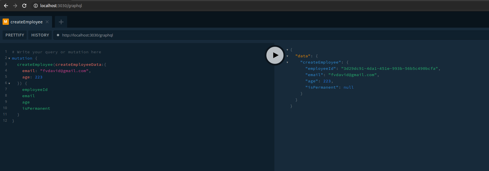
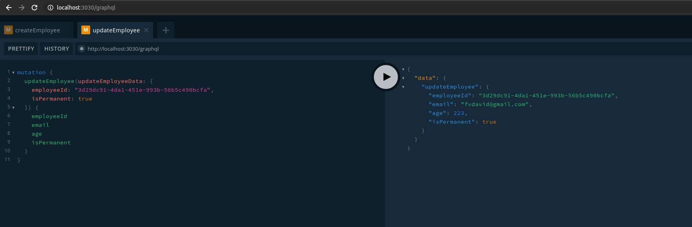
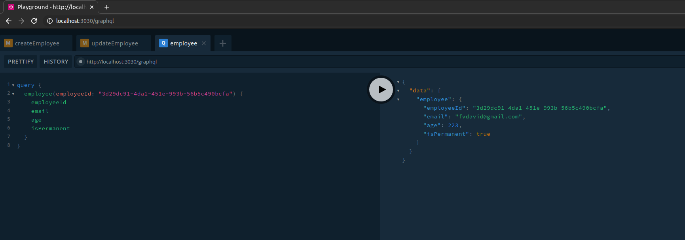
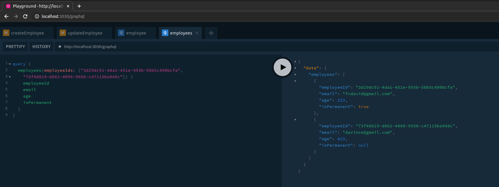
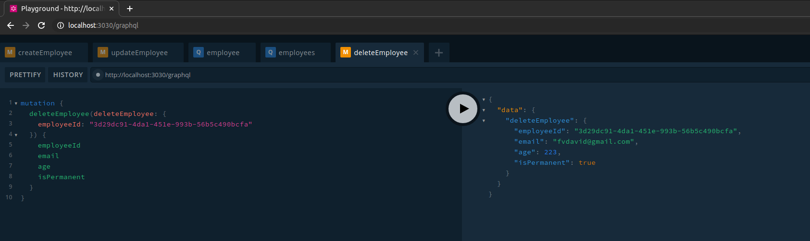

## CRUD with GraphQL

API CREATE


API UPDATE


API FIND BY ID


API FIND ALL


API DELETE



## Running the app

```bash
# development
$ npm run start
or
$ nest start

# watch mode
$ npm run start:dev

# production mode
$ npm run start:prod
```

## Test
in my machine: http://localhost:3030/graphql
